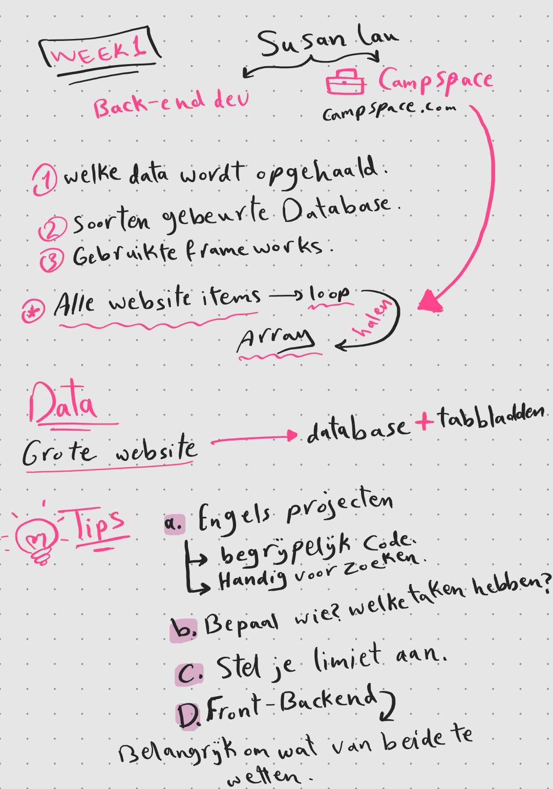
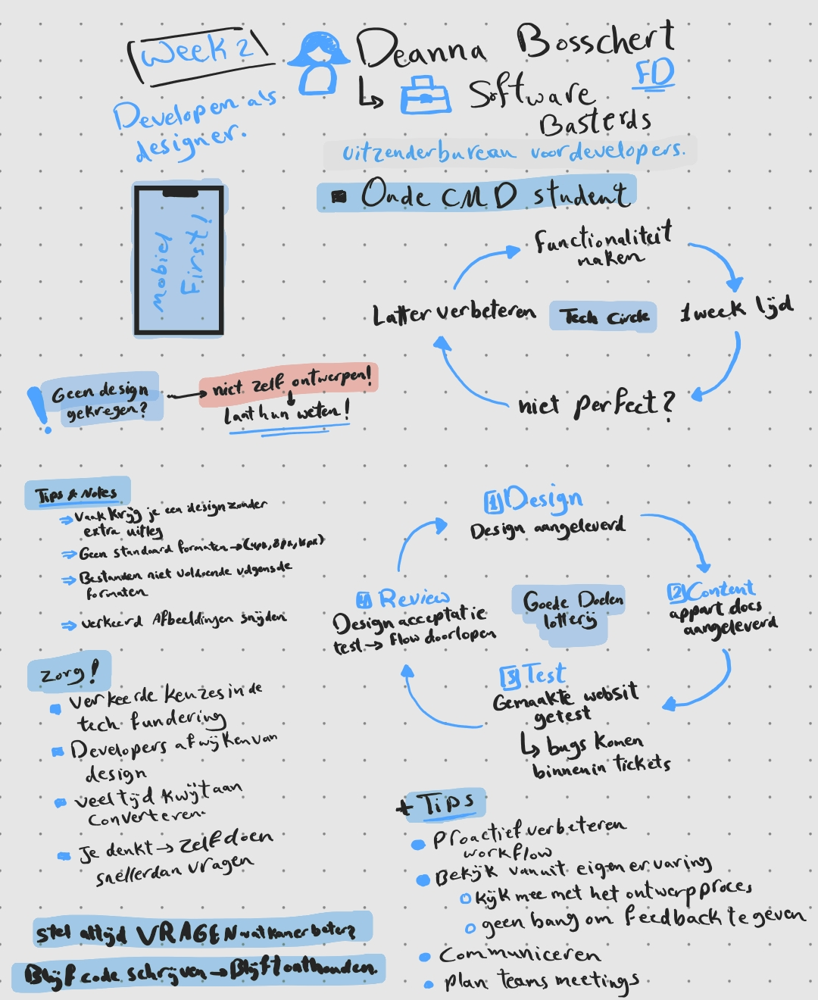
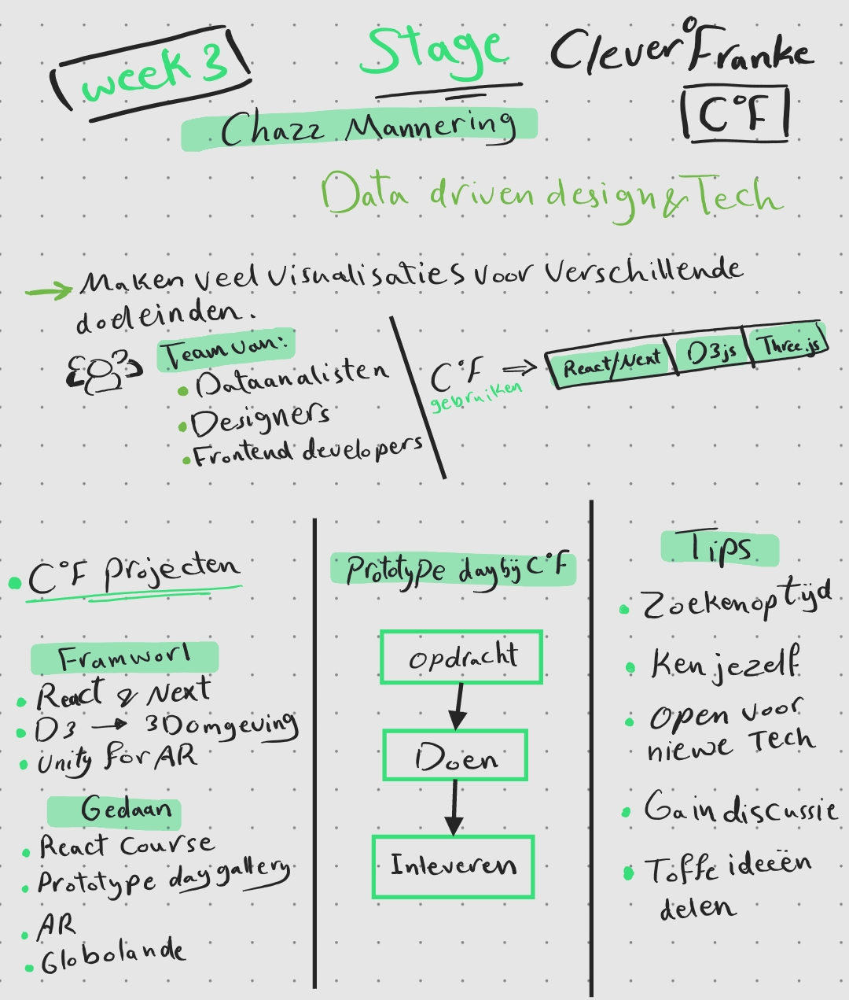
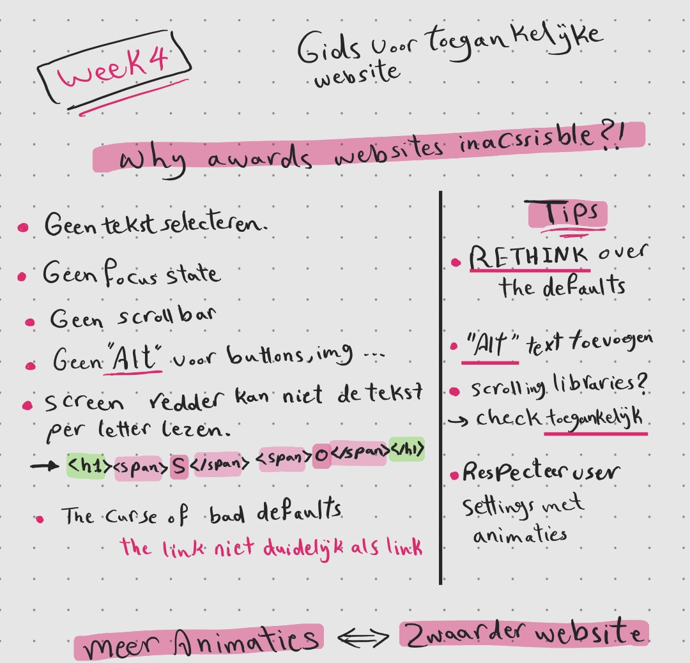
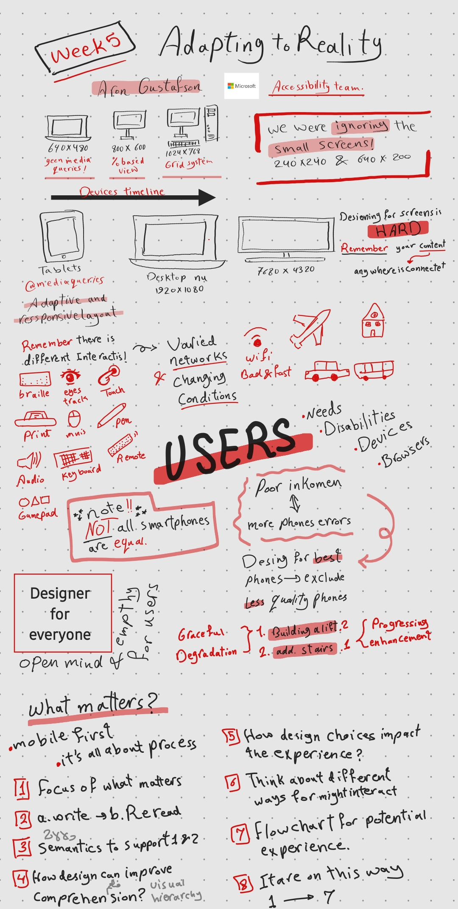
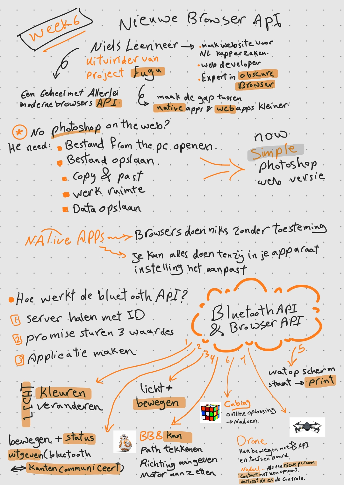
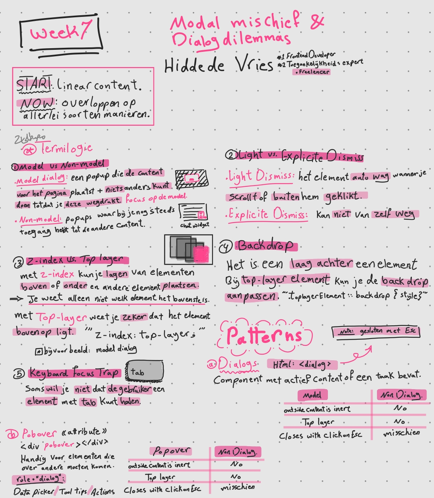
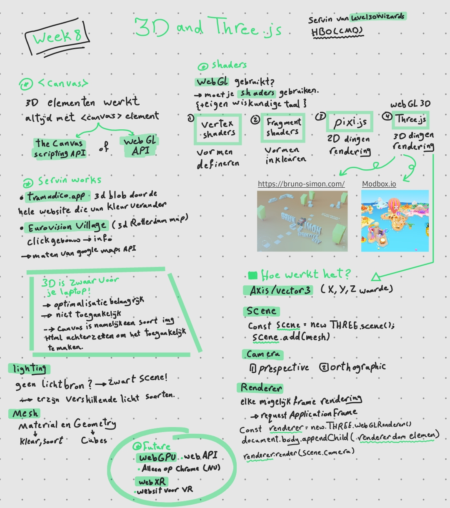
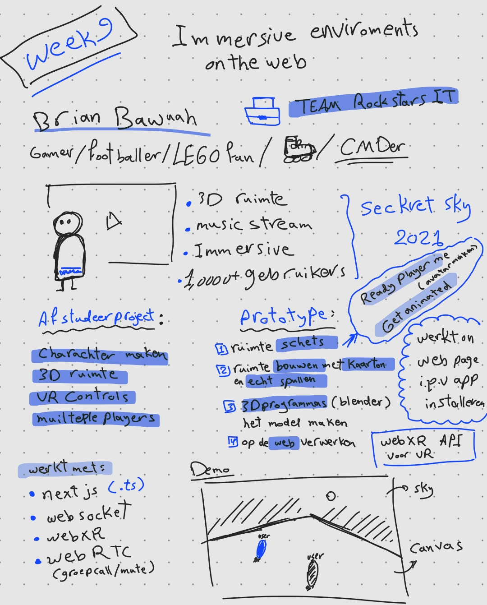
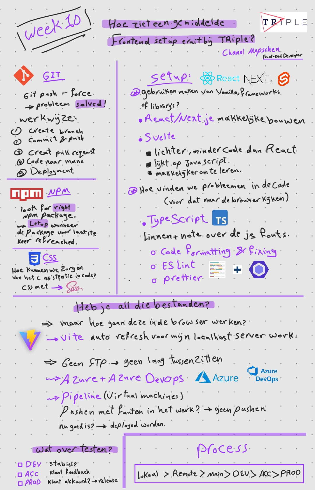

# Weekly Nerd [@cmda-minor-web](https://github.com/cmda-minor-web) 2022 - 2023

Tijdens de minor Web design and development worden een aantal sessies georganiseerd om kennis te maken met het vakgebied. 
Workshops, praatjes en lezingen van bedrijven en designers over het vakgebied. Nerd alert.

### Sketch nots
<!-- <td></td> -->
<table>
    <tr>
        <th>Spreker</th>
        <th>Datum</th>
        <th>Sketch note</th>
    </tr>
    <tr>
        <td>Susan Lau</td>
        <td>17 februari / 12:00 - 13:00</td>
        <td>
            

                
            

        </td>
    </tr>
    <tr>
        <td>Deanna Bosschert</td>
        <td>22 februari / 16:00 - 17:00</td>
        <td>
            

                
            

        </td>
    </tr>
    <tr>
        <td>Chazz Mannering</td>
        <td>15 maart / 16:00 - 17:00</td>
        <td>
            

                
            

        </td>
    </tr>
    <tr>
        <td>Cyd Stumpel</td>
        <td>22 maart / 16:00 - 17:00</td>
        <td>
            

                
            

        </td>
    </tr>
    <tr>
        <td>Aaron Gustafson</td>
        <td>30 maart</td>
        <td>
            

                
            

        </td>
    </tr>
    <tr>
        <td>Niels Leenheer</td>
        <td>12 april 16:00 - 17:00</td>
        <td>
            

                
            

        </td>
     </tr>
    <tr>
        <td>Hidde de Vries.</td>
        <td>19 april 16:00 - 17:00</td>
        <td>
            

                
            

        </td>
    </tr>
    <tr>
        <td>Level30Wizards</td>
        <td>26 april 16:00 - 17:00</td>
        <td>
            

                
            

        </td>
    </tr>
    <tr>
        <td>NXT Museum</td>
        <td>15 mei / vanaf 13:00</td>
        <td>
            <a href="./NxT-Museum.md">Artikle</a>
        </td>
    </tr>
    <tr>
        <td>Brian Buwuah</td>
        <td>22 mei / 16:00 - 17:00</td>
        <td>
            

                
            

        </td>
    </tr>
        <tr>
        <td>Chanel Mepschen</td>
        <td>31 mei / 16:00 - 17:00</td>
        <td>
            

                
            

        </td>
    </tr>
    <tr>
        <td>Pre cssday</td>
        <td>7 Juni / 16:00 - 17:30</td>
        <td>
        </td>
    </tr>
        <tr>
        <td>Socket.io</td>
        <td></td>
        <td>
            <a href="./Socket.io.md">Artikle</a>
        </td>
    </tr>
        </tr>
    <tr>
        <td>Svelte</td>
        <td></td>
        <td>
            <a href="./Svelte.md">Artikle</a>
        </td>
    </tr>
    <tr>
        <td>Container queries</td>
        <td></td>
        <td>
            <a href="./Container-queries.md">Artikle</a>
        </td>
    </tr>
</table>
