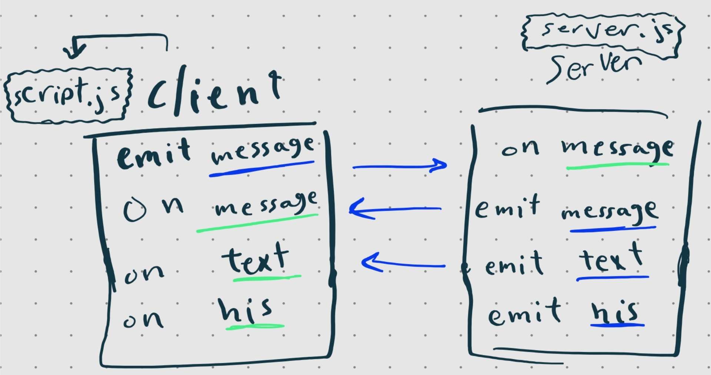

# Wat is Socket.IO?
Socket.IO is een bibliotheek die low-latency, bidirectionele en op gebeurtenissen gebaseerde communicatie tussen een client en een server mogelijk maakt.

Socket.io maakt directe gegevensuitwisseling mogelijk tussen server en client. Het wordt gebruikt voor het bouwen van websites met realtime functionaliteiten, zoals één-op-één of groepschats. Met Him kunnen gebruikers real-time updates ontvangen en verzenden, wat zorgt voor een interactieve gebruikerservaring. Het maakt ook synchronisatie van gegevens tussen verschillende apparaten mogelijk. Het opent de deur naar diverse mogelijkheden voor realtime gegevensuitwisseling op het web.



## Hoe kan ik Socket.io gebruiken?
Om socket.io te kunnen gebruiken, gaan we het Node.js-webframework Express gebruiken. Zorg ervoor dat Node.js is geïnstalleerd op je systeem. Vervolgens kun je de volgende stappen uitvoeren in de terminal:

1. Open de terminal en navigeer naar de juiste map waarin je projectbestanden zich bevinden en install de npm package:
```
npm install express@4
```
 2. Als alles correct is geconfigureerd, wordt de Node.js-server gestart en kun je socket.io-functionaliteit gebruiken in combinatie met Express.
 3. Socket.IO bestaat uit twee delen:
    - Een server die integreert met (of wordt gekoppeld aan) de Node.JS HTTP Server-socket.io
    - Een clientbibliotheek die wordt geladen aan de browserzijde socket.io-client
  4. Socket.io installeren:
  ```
  npm install socket.io
  ```
  Nu hebben we dit in onze server.js
```
const express = require('express');
const app = express();
const http = require('http');
const server = http.createServer(app);
const { Server } = require("socket.io");
const io = new Server(server);

app.get('/', (req, res) => {
  res.sendFile(__dirname + '/index.html');
});

io.on('connection', (socket) => {
  console.log('a user connected');
});

server.listen(3000, () => {
  console.log('listening on *:3000');
});
```
5. We moeten nu de socket.io koppelen met de html bestand
```
.
.
.
<script src="/socket.io/socket.io.js"></script>
<script>
  var socket = io();
</script>
</body>
```
6. restart jouw live review van de applicatie met het terminal hulp:
```
node index.js
```
En vernieuw vervolgens de webpagina, u zou de console moeten zien afdrukken "a user connected".

7. We kunnen ook het event "disconnect" gebruiken:
```
io.on('connection', (socket) => {
  console.log('a user connected');
  socket.on('disconnect', () => {
    console.log('user disconnected');
  });
});
```
## Hoe wordt de client side gekoppeld met de server side?

1. In de client side maken we de interactie key die moet werken om het server side event te actieveren bijvoorbeeld een knop.
<br> we kunnen ook data naar de andere gebruikers sturen

```js
const button = document.querySelector("#button");

button.addEventListener("click" , () => {
  socket.emit('Check', {message: "Hi there"});
})
```
2. Dan maken we de server side event die moet onze message naar ale gebruikers sturen
```js
io.on('connection', (socket) => {
  socket.on('Check', (message) => {
  io.emit('Check', message);
  });
});
```
3. Daarna maken we de socket event in de client side en die event gaat de data uit de server halen voor de gebruikers
```js
socket.on('Check', (message) => {
console.log("The message:", message)
})
```

4. Nu alle gebruikers moeten in de console dit zien als 1 gebruiker de button gedrukd
```js
The message:Hi there
```

5. Nu kunnen we beginnen met het bouwen van een eenvoudige chat voor het uitwisselen van tekst berichten.

## Other features
wanneer wordt socket.io gekoppeld met verschillende API, wordt zijn features groeter zoals:
- youtuob API = YouTube-video's kunnen collectief worden bekeken
- GIFs API = Deel GIF's
- vragen API = Speel samen mysteriespellen / snelle groepstest
<br>.
<br>.
<br>enzofoort

## Voorbeeld over socket.io met Youtube api en gif's api
[Streamy-Chan](https://github.com/SundousKanaan/Streamy-Chan)

---

### Bronnnen
- https://socket.io/docs/v4/
- https://socket.io/get-started/chat/
